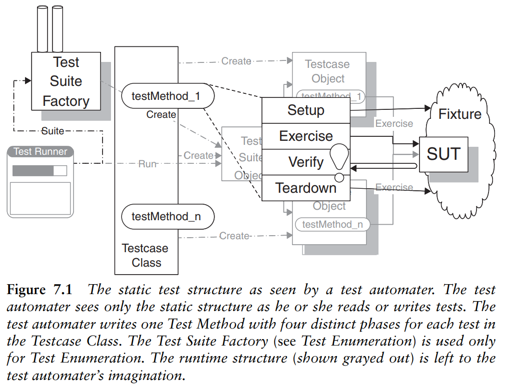
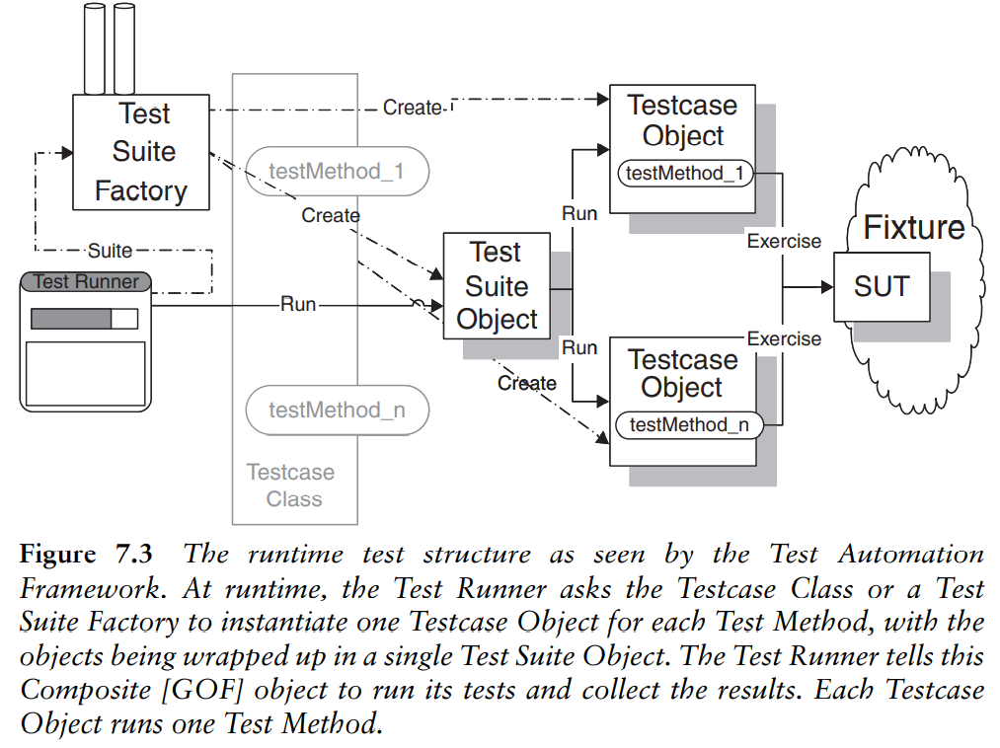

# 第一章 introduction

**什么是好的单元测试**

tip: ( )内为xUnit具体页码

1. not too long (obsure test page 180)
2. 能够体现项目/系统的使用 how the system is used, 接口测试
3. 简单 易理解，可以看到具体某项测试的测试目的是什么，测试什么功能
4. Layer Test 从尽可能多的角度去测试程序逻辑
   > 比如实现了分类模型的功能，同时有对外接口去调用这个功能，那么可以在内外部同时测试这个分类逻辑结果是否正确，外部测试使用对外接口函数，内部直接使用该函数或者类方法。
   >
5. Fully-Automated Test 完全自动化的测试
6. Defect Localization 能够利用测试结果快速定位程序的问题所在
7. Not erratic 不存在随机因素，每次测试的结果必定唯一
8. Fresh Fixture：一类测试开始之前确定好其依赖的环境，环境何时注销，是否复用
9. 好莱坞原则：测试只会在有问题的时候通知开发者

# 第三章 Goals of Test Automation

单元测试的目的主要为

1. improve code quality
2. understand the SUT(system under test)
3. reduce and not introduce risk
4. easy to run
5. easy to write and maintain
6. require mimimal maintenance when the project evolves

### improve code quality

- 测试可以反映出这个项目在实际应用中是如何使用的
- Defect Localiaztion：在不同的测试名称中(GTEST可以对测试命名)测试尽可能多的功能，保证颗粒度不会因为过粗导致不能及时发现是哪里的功能实现不及预期
- 尽量涵盖一切极端的使用情况

### understand the SUT

- 通过断言或者注释的方式 能够让项目后续其他开发者在跑测试的过程中，通过测试理解项目的运行机制，运行中功能的期望输出

### easy to run

- 可以自动测试，可以指定测试
- 可以自我测试，汇报出测试错误在哪里
- 测试是可重复的
  这几点在利用GTEST框架是非常容易实现的，因为GTEST本身满足了这些条件，包括指定特定的测试，生成错误信息日志，定位到错误的地方

### easy to write and maintain

不要在同一个测试中放入过多的小测试，即不要在一个测试函数中测试多个功能，这样不利于错误定位，也不利于后继开发者对项目系统的理解，更不利于后期往其中增加测试

### require mimimal maintenance when the project evolves

- 不同测试之间的重复尽可能降低
- 测试代码与生产代码尽可能分离（这样能够测试更加全面
- 测试代码的写法不要与项目实现功能代码过于藕合，尽可能在函数接口上统一即可，以免出现后期重构代码带来测试无法运行，测试过程依赖原先项目代码等问题

# 第四章 测试自动化哲学

在写单元测试的过程中，需要注意以下这些问题，是设计的重点

1. write test first or last [**first**]
2. test all-at-once or test-by-test [**either**]
3. build the project inside-out or outside-in  [**either**]
4. verify state or behavior
5. design the fixture upfront or test by test
6. treat as tests or examples

## write test first or last

**first**

- 如果是先写产品代码再去补上单元测试，往往不是非常顺利，为了写好测试，你可能还需要对产品代码改动
- 先把测试对象的环境验证与结果验证写好，这样在开发完产品代码后，我们能够直接看出，刚刚实现的产品功能是否符合预期
- 不必对先完成测试代码感到疑惑，就如同example-driven development（EDD）一样，Test-driven development（TDD） 也是一类开发方式

## test all-at-once or test-by-test

**either**

- 对write test first 的进一步解释是 不必完成整个项目所有的test develop in an incremental approach” 就是 “test a bit, code a bit, test a bit more" 设置一个小目标，完成，再设置，再完成
- 但这并不是唯一的方式，如果developer喜欢设置完所有的test再开始code也是可以的（只要确保能够快速进行defect localization
- 具体写测试代码的时候，我们应该规划好，测试内容是如何分门别类的（Gtest中的命名), 将框架设置好，然后再丰富每个测试的内部内容

## inside-out or outside-in

**either**

- 这两种方式都可以，核心问题都是解决好“dependency problem”
- 这种依赖问题的产生是因为往往很多后续的功能依赖于一些基础类，基础功能；例如outside-in时，如果没有完善内部具体的某个功能测试，发生了错误，这样你无法确定是这个大功能中是哪个小功能错误了

## verify state or behavior

- state 就是我们只要确保在使用某些api接口的前后，输入与输出是我们期望的状态/值
- behavior 我们不仅要确保state，还要验证接口内部的工作流程，这样能够更好定位，但这种behavior verification 重构代码会更加的复杂

## design the fixture upfront or test by test

- 所有的测试基于一样的环境（shared fixture）还是每个测试都会单独初始化环境，并在结束后注销环境呢（fresh fixture）
- 其实都是可以的，一个效率更高，统一性更强；一个能够更好地定位错误，且能够单独跑特定测试

## 作者的测试哲学

作者推荐的测试方式总结如下：

1. code before test；完成每一步功能之前都需要对它的实现写测试
2. tests are examples； 测试也是样例，和开发者或客户使用接口是一样的
3. 作者更喜欢写一个test，然后实现一个功能；但有时候将所有的测试框架列出来也是好的
4. outside-in是作者喜欢的方式
5. 作者喜欢在一开始用state verification的方式写，如果有足够的时间或者追求good code coverage，会慢慢改写补充成behavior verification
6. perform fixture design on a test-by-test basis

# 第五章 Principles of Test Automation

The Manifesto is a list of the qualities we would like to see in a test—not a set of patterns that can be directly applied.
这些规则是一系列凝炼出来的规则而非可以直接模仿使用的模式。

## 1. Write the Tests First

有两个理由：1. TDD(Test-Driven Development) 可以节省不少debug时间 2. 完成的代码具有可测试性，不必后期为了测试功能再调整代码

## 2. Design for Testability

与规则1类似，写的代码可测试性强的话会方便调试

## 3. Use the Front Door First

设计系统或者sdk，总是有一些对外的public的接口，优先测试这些接口

## 4.Communicate Intent

写的测试样例可读性要好，能够让其余开发者明白这个测试的目的，这有利于代码重构，后续开发，系统丰富化等工作

## 5.Don’t Modify the SUT（system under test）

修改已经可用的单元测试是比较危险的，因为这样的行为不能保证修改部分的功能能在产品中保有原先的功能(例如crowdmax中修改了脚点判断逻辑导致单元测试失败)

## 6. Keep Tests Independent

尽量降低各个测试功能间的依赖，如果可以，可以使用一些编造的虚拟测试数据
降低了各个测试之间的依赖，更容易找到出现问题的部分

## 7. Isolate the SUT

独立我们的系统，如果我们的代码依赖于其他的库，尽可能将这部分整合，因为我们的测试中必须使用依赖的api，但我们无法测试验证它们(例如我们依赖于kestrel的环境初始化等，尽可能将它的调用与我们的测试分在不同的测试部分，这样的话能够快速验证是否我们所写的代码部分的问题)

## 8. Minimize Test Overlap

系统功能总会有一些重复的地方，我们在测试中尽可能降低重复测试，提高效率

## 9. Minimize Untestable Code

即考虑尽可能周到，涉及到所写的逻辑功能，数据结构等

## 10. Keep Test Logic Out of Production Code

更准确的说法No Test Logic in Production Code，在业务逻辑代码中最好不要放入很多测试(如果有必要，那么用编译选项隔离开，可见flock_pipeline kestrel_crowdmax中的一些放在业务代码中的测试)

## 11. Verify One Condition per Test

一个测试样例中放一个测试样例是最好的，这样出错的时候可以快速定位

## 总结

拆分我们的测试步骤
see Four-Phase Test that are executed in sequence: fi xture setup, exercise SUT, result verification, and fixture teardown.

1. 初始化测试环境(例如flock kestrel)，同时我们应该设置好我们期望得到的结果，例如人群计数的真值(ground_truth)
2. 跑逻辑代码
3. 根据业务api得到的结果 验证结果(一般来说，单元测试的重点就在于这一步，当然第二步也很重要，但是验证实现的目标是否正确是首要的)
4. 别忘记析构

# 第六章 自动化测试策略

Which kinds of tests to automate?
Which tools to use to automate them?
How to manage the test fi xture?
How to ensure that the system is easily tested and how the tests interact
with the SUT

## Which kinds of tests to automate
1. Customer Tests
对于客户的理解就是使用这个sdk的人群，即和我们对接的下游团队，他们使用的是include文件夹下的api，这个部分的测试就是保证那些interface function都能达到预期的作用
2. Unit Tests
这个单元测试是狭义的单元测试 不是广义的，我们平时所说的那种单元测试。
它的测试对象就是一个单独的函数 或者一个单独的类方法 （single class or method）
3. Fault Insertion Tests
错误/故障测试，这个测试就是在各个类初始化，函数工作中，故意传入不合格，不符合输入形式的参数，以检查程序是否能够面对一切非正常输入给出正确的日志信息(log info)和错误码（error code).
4. Component Tests
这是一个验证服务类的测试，什么叫服务类呢，我的理解是它是将单元测试中的测试对象与接口（客户）测试（上述的1.与2.）衔接起来的类，可能是一些工厂模式设计的基类，诸如此类，并不会像2.单元测试那么具体到具体的功能，但是要保证它的衔接作用正常。
5. Property Tests
这个属性测试的内容包含就很广了，不是我们认为的单元测试的范围，列举如下，作者认为这些测试能够自动化是最好的
- Response time tests /可以认为是我们的性能测试的一部分，但并不是性能测试的全部
- Capactiy test
- Stress tests /稳定性测试
6. Usability Tests
可用性测试，这个是针对设计的接口函数是否易用，这个是很难自动化测出来的，只能通过使用人员的感受得知

## Which tools do we use to automate which tests?
为了实现测试的简易，我们需要一些工具，这里一般就使用google的GTEST
## How to manage the test fixture?
这个test fixture 包括了硬件（什么平台什么计算卡), 什么框架(kestrel, flock 什么版本)等
我们需要实现为固定的测试环境准备好特定的测试步骤，因为一旦环境发生了变化，很多时候，很难进行修改测试代码

# 第七章 xUnit基础

在上一章中，作者讨论了一些应该在项目中尽早做出的决定，本章主要包括两个部分，其一是介绍在本书中一直使用的xUnit的术语和图表规范，其二是解释xUnit框架是怎样运行以及设计思路。

## xUNit介绍

只要拥有一套指定特性的，使用测试脚本进行自动测试的自动测试框架都可以被称作xUnit。大部分广泛使用的编程语言都有自己的xUnit实现。

## xUnit的特性

xUnit 框架都拥有以下这些特性：

- 指定一个测试为测试方法
- 使用断言方法指定测试方法应该有的结果
- 将测试组成能作为一个操作运行的*测试套件(test suite)*
- 运行一项或多项测试以获取有关测试运行结果的报告

部分xUnit家族的成员支持*测试方法发现(test Method Discovery)*

## xUnit 如何运行

要理解xUnit 如何工作，我们至少需要回答以下这些问题：

- 怎样使用测试类中的测试方法定义测试
- 怎样任意地构建测试套件
- 如何运行测试
- 如何理解测试结果

### 定义测试

每一个测试都由一个测试方法代表。每一个测试方法都实现了一个四相测试，包括以下这些步骤

- 建立测试环境（测试夹具 test fixture)
- 执行测试/执行SUT（system under test)
- 校验测试结果：使用断言
- 移除测试环境

最常见的测试类型是判断系统能否在有效输入下正常工作的简单成功测试（Simple Success Test)，和判断系统在错误使用时能否抛出异常的期望异常测试（Expected Exception Test）。构建测试检查我们的对象构建逻辑能否正常构建对象。

测试方法包含了我们的测试的逻辑，我们把它们定义为测试类的方法。之后我们会把这个测试方法的名字传递给测试运行类去运行测试。

### 什么是夹具(Fixture)

夹具指的是所有我们在进行测试时需要的环境。一般来说，它包括了我们正在测试的方法的类的至少一个实例。它可能还包括其他测试依赖的对象。值得注意的是，某些xUnit家族的成员会把测试类叫做测试夹具。

### 定义测试套件

大部分测试运行类会自动地构建一个包含测试类里所有测试方法的测试套件。部分xUnit框架或第三方工具实现了测试用例发现特性，可以让测试运行器自动地通过搜索路径或者是可执行文件来寻找测试套件。

### 运行测试

使用测试运行器运行测试。测试运行器可以分为带图像界面的与命令行的。

### 测试结果

运行测试自然是为了得到结果。Unit家族的成员遵循好莱坞原则（没有消息就是好消息）,测试只会在有问题的时候通知开发者。

测试结果可以被分类为以下三种：

- 没有任何错误，为一个成功的测试
- 有断言失败，为一个失败的测试，自动测试框架会对其进行计数并且保留其错误信息。一个测试的失败不应影响其他测试的进行
- SUT或者测试本身以一个没有料想的方式失败，为一个有问题的测试。和失败的测试一样，自动测试框架会对其进行计数并且保留其错误信息。

## 进一步理解xUnit的运行方式

对于大部分xUnit家族的成员，每一个测试方法在运行时都是由一个测试对象代表的，测试对象会进一步被组装为测试套件对象，测试套件可以被用于一次操作运行多个测试。

### 测试命令

大部分xUnit框架都将每一个测试方法转换为一个有run方法的对象。为了创造这些对象，测试运行器会调用测试类的suite方法去构建一个测试套件对象。测试套件对象之后会调用测试对象的run方法。测试对象的run方法会执行它对应的测试方法。测试套件对象的run方法会执行套件中所有的测试。

### 测试套件对象

测试套件对象的接口同一般的测试对象相同，同样拥有run方法。当测试套件对象的run方法被调用时，它包含的所有测试都会被运行。通过这样的设计，运行一个测试和运行许多测试的过程是类似的。

测试套件对象是如何产生的呢？一般来说测试用例类充当测试套件工厂。测试套件工厂会提供一个suite方法，这个方法会返回包含这个类里所有测试的测试套件对象。

## 过程式编程语言中的xUnit

自动测试框架和测试驱动开发都是在面向对象语言成为主流之后才流行的。大部分xUnit 框架都是以面向对象语言实现的。

如果我们没有对象或者类，测试方法将以全局(global/public static)过程的形式存在。这些方法一般保存在文件或模块里。如果语言支持过程变量（函数指针），我们可以定义一个以一个测试方法数组为参数的一般测试套件。

如果语言不能把测试方法当作数据处理，我们必须显式地定义测试套件，显式地写出对于其中每一个测试方法的调用。

一个最后的选择是把测试编码成文件中的数据然后使用一个数据驱动测试解释器去执行他们。这样做的坏处是限制了可以进行的测试种类，但这样做可以将测试从开发中分离出来，利于进行用户测试。

## 第八章 Transient Fixture Management
