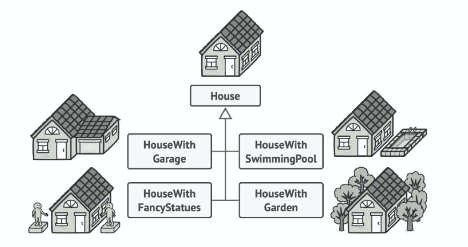
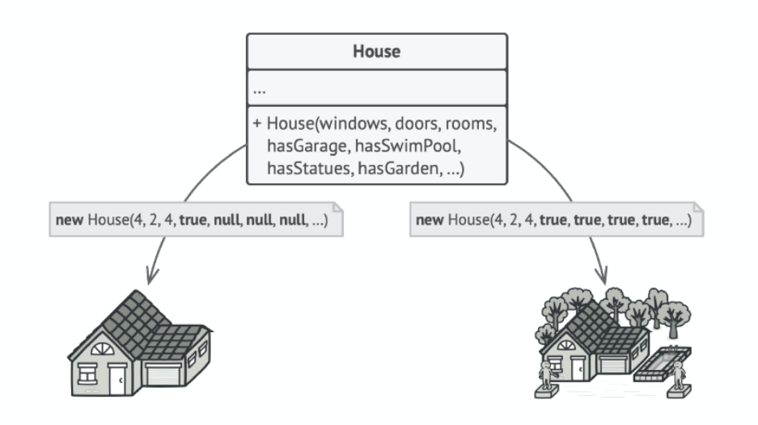
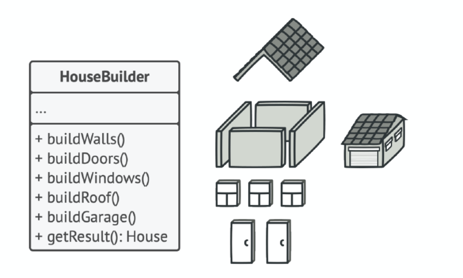

[22种设计模式的C++实现](https://zhuanlan.zhihu.com/p/476220724)

## 工厂模式

### 简单工厂

**简单工厂模式的结构组成：**

1. 工厂类：工厂模式的核心类，会定义一个用于创建指定的具体实例对象的接口。
2. 抽象产品类：是具体产品类的继承的父类或实现的接口。
3. 具体产品类：工厂类所创建的对象就是此具体产品实例

**简单工厂模式的特点：**
工厂类封装了创建具体产品对象的函数。
简单工厂模式的缺陷：
扩展性非常差，新增产品的时候，需要去修改工厂类。

**简单工厂模式的代码：**
Shoes为鞋子的抽象类（基类），接口函数为Show()，用于显示鞋子广告。
NiKeShoes、AdidasShoes、LiNingShoes为具体鞋子的类，分别是耐克、阿迪达斯和李宁鞋牌的鞋，它们都继承于Shoes抽象类。

```c++
// 鞋子抽象类
class Shoes
{
public:
    virtual ~Shoes() {};
    virtual void Show() = 0;
};

// 耐克鞋子
class NiKeShoes : public Shoes
{
public:
    void Show()
    {
        std::cout << "我是耐克球鞋，我的广告语：Just do it" << std::endl;
    }
};

// 阿迪达斯鞋子
class AdidasShoes : public Shoes
{
public:
    void Show()
    {
        std::cout << "我是阿迪达斯球鞋，我的广告语:Impossible is nothing" << std::endl;
    }
};

// 李宁鞋子
class LiNingShoes : public Shoes
{
public:
    void Show()
    {
        std::cout << "我是李宁球鞋，我的广告语：Everything is possible" << std::endl;
    }
};
```

ShoesFactory为工厂类，类里实现根据鞋子类型创建对应鞋子产品对象的CreateShoes(SHOES_TYPE type)函数。

```c++
enum SHOES_TYPE
{
    NIKE,
    LINING,
    ADIDAS
};

// 总鞋厂
class ShoesFactory
{
public:
    // 根据鞋子类型创建对应的鞋子对象
    Shoes *CreateShoes(SHOES_TYPE type)
    {
        switch (type)
        {
        case NIKE:
            return new NiKeShoes();
            break;
        case LINING:
            return new LiNingShoes();
            break;
        case ADIDAS:
            return new AdidasShoes();
            break;
        default:
            return NULL;
            break;
        }
    }
};
```

调用先是构造了工厂对象，后创建指定类型的具体鞋子产品对象，创建了具体鞋子产品的对象便可直接打印广告。因为采用的是 `new`的方式创建了对象，用完了要通过 `delete` 释放资源资源

```c++
int main()
{
    // 构造工厂对象
    ShoesFactory shoesFactory;

    // 从鞋工厂对象创建阿迪达斯鞋对象
    Shoes *pNikeShoes = shoesFactory.CreateShoes(NIKE);
    if (pNikeShoes != NULL)
    {
        // 耐克球鞋广告喊起
        pNikeShoes->Show();

        // 释放资源
        delete pNikeShoes;
        pNikeShoes = NULL;
    }

    // 从鞋工厂对象创建阿迪达斯鞋对象
    Shoes *pLiNingShoes = shoesFactory.CreateShoes(LINING);
    if (pLiNingShoes != NULL)
    {
        // 李宁球鞋广告喊起
        pLiNingShoes->Show();

        // 释放资源
        delete pLiNingShoes;
        pLiNingShoes = NULL;
    }

    // 从鞋工厂对象创建阿迪达斯鞋对象
    Shoes *pAdidasShoes = shoesFactory.CreateShoes(ADIDAS);
    if (pAdidasShoes != NULL)
    {
        // 阿迪达斯球鞋广告喊起
        pAdidasShoes->Show();

        // 释放资源
        delete pAdidasShoes;
        pAdidasShoes = NULL;
    }

    return 0;
}
```

### 工厂方法模式

**工厂方法模式的结构组成：**

1. 抽象工厂类：工厂方法模式的核心类，提供创建具体产品的接口，由具体工厂类实现。
2. 具体工厂类：继承于抽象工厂，实现创建对应具体产品对象的方式。
3. 抽象产品类：它是具体产品继承的父类（基类）。
4. 具体产品类：具体工厂所创建的对象，就是此类。

**工厂方法模式的特点：**
工厂方法模式抽象出了工厂类，提供创建具体产品的接口，交由子类去实现。
工厂方法模式的应用并不只是为了封装具体产品对象的创建，而是要把具体产品对象的创建放到具体工厂类实现。

**工厂方法模式的缺陷：**
每新增一个产品，就需要增加一个对应的产品的具体工厂类。相比简单工厂模式而言，工厂方法模式需要更多的类定义。
一条生产线只能一个产品

### 抽象工厂

与上述工厂方法类似
简单来说：工厂方法模式的工厂是创建出**一种**产品，而抽象工厂是创建出**一类**产品。

**抽象工厂代码示例**

```c++
// 抽象工厂类 生产电影和书籍类等
class Factory {
 public:
    virtual std::shared_ptr<Movie> productMovie() = 0;
    virtual std::shared_ptr<Book> productBook() = 0;
};

// 具体工厂类 中国生产者
class ChineseProducer : public Factory {
 public:
    std::shared_ptr<Movie> productMovie() override {
        return std::make_shared<ChineseMovie>();
    }

    std::shared_ptr<Book> productBook() override {
        return std::make_shared<ChineseBook>();
    }
};

// 具体工厂类 日本生产者
class JapaneseProducer : public Factory {
 public:
    std::shared_ptr<Movie> productMovie() override {
        return std::make_shared<JapaneseMovie>();
    }

    std::shared_ptr<Book> productBook() override {
        return std::make_shared<JapaneseBook>();
    }
};

// 抽象产品类 电影
class Movie {
 publ// 抽象产品类 电影
class Movie {
 public:
    virtual std::string showMovieName() = 0;
};

// 抽象产品类 书籍
class Book {
 public:
    virtual std::string showBookName() = 0;
};
ic:
    virtual std::string showMovieName() = 0;
};

// 抽象产品类 书籍
class Book {
 public:
    virtual std::string showBookName() = 0;
};
```

```c++
int main() {
    std::shared_ptr<Factory> factory;

    // 这里假设从配置中读到的是Chinese(运行时决定的)
    std::string conf = "China";

    // 程序根据当前配置或环境选择创建者的类型
    if (conf == "China") {
        factory = std::make_shared<ChineseProducer>();
    } else if (conf == "Japan") {
        factory = std::make_shared<JapaneseProducer>();
    } else {
        std::cout << "error conf" << std::endl;
    }

    std::shared_ptr<Movie> movie;
    std::shared_ptr<Book> book;
    movie = factory->productMovie();
    book = factory->productBook();
    std::cout << "获取一部电影: " << movie->showMovieName() << std::endl;
    std::cout << "获取一本书: " << book->showBookName() << std::endl;
}
```

> 获取一部电影: 《让子弹飞》
> 获取一本书: 《三国演义》

### 总结

以上三种工厂模式，在新增产品时，都存在一定的缺陷。

简单工厂模式，，需要去修改工厂类，这违背了开闭法则。
工厂方式模式和抽象工厂模式，都需要增加一个对应的产品的具体工厂类，这就会增大了代码的编写量。

### 注册+工厂模式（caffe layer/solver的实现）

TODO

## 单例模式

单例是一种创建型设计模式，让你能够保证一个类只有一个实例，并提供一个访问该实例的全局节点。
为什么会有人想要控制一个类所拥有的实例数量？最常见的原因是控制某些共享资源（例如数据库或文件）的访问权限。它的运作方式是这样的：如果你创建了一个对象，同时过一会儿后你决定再创建一个新对象，此时你会获得之前已创建的对象，而不是一个新对象。
和全局变量一样，单例模式也允许在程序的任何地方访问特定对象。但是它可以保护该实例不被其他代码覆盖。

> 注意，普通构造函数无法实现上述行为，因为构造函数的设计决定了它必须总是返回一个新对象。

**最常见的就比如计算一个程序的运行时长，定义一个timer类，会使用单例模式。**

### 如何设计

所有单例的实现都包含以下两个相同的步骤：

- 将默认构造函数设为私有， 防止其他对象使用单例类的new运算符。
- 新建一个静态构建方法作为构造函数。该函数会“偷偷”调用私有构造函数来创建对象，并将其保存在一个静态成员变量中。此后所有对于该函数的调用都将返回这一缓存对象。

### 优点

- 你可以保证一个类只有一个实例。
- 你获得了一个指向该实例的全局访问节点。
- 仅在首次请求单例对象时对其进行初始化

### 缺点

- 违反了单一职责原则。该模式同时解决了两个问题
- 单例模式可能掩盖不良设计，比如程序各组件之间相互了解过多等。
- 该模式在多线程环境下需要进行特殊处理，避免多个线程多次创建单例对象。
- 单例的客户端代码单元测试可能会比较困难，因为许多测试框架以基于继承的方式创建模拟对象。由于单例类的构造函数是私有的，而且绝大部分语言无法重写静态方法，所以你需要想出仔细考虑模拟单例的方法。要么干脆不编写测试代码，或者不使用单例模式。

### 懒汉与饿汉

1.懒汉模式:顾名思义,他是一个懒汉,他不愿意动弹。什么时候需要吃饭了,他就什么时候开始想办法搞点食物。 即懒汉式一开始不会实例化,什么时候用就什么时候new,才进行实例化。
2.饿汉模式:顾名思义,他是一个饿汉,他很勤快就怕自己饿着。他总是先把食物准备好,什么时候需要吃了,他随时拿来吃,不需要临时去搞食物。 即饿汉式在一开始类加载的时候就已经实例化,并且创建单例对象,以后只管用即可。

#### 对比

（1） 线程安全：饿汉式在线程还没出现之前就已经实例化了，所以饿汉式一定是线程安全的。懒汉式加载是在使用时才会去new 实例的，那么你去new的时候是一个动态的过程，是放到方法中实现。
如果这个时候有多个线程访问这个实例，这个时候实例还不存在，还在new，就会进入到方法中，有多少线程就会new出多少个实例。一个方法只能return一个实例，那最终return出哪个呢？是不是会覆盖很多new的实例？这种情况当然也可以解决，那就是加同步锁，避免这种情况发生 。
（2）执行效率：饿汉式没有加任何的锁，因此执行效率比较高。懒汉式一般使用都会加同步锁，效率比饿汉式差。
（3）内存使用：饿汉式在一开始类加载的时候就实例化，无论使用与否，都会实例化，所以会占据空间，浪费内存。懒汉式什么时候用就什么时候实例化，不浪费内存。

### 懒汉单例模式

注意懒汉模式在不加锁情况下是线程不安全的

```c++
#ifndef SINGLETON_H_
#define SINGLETON_H_

#include <iostream>
#include <string>

class Singleton {
 public:
    static Singleton* GetInstance() {
        if (instance_ == nullptr) {
            instance_ = new Singleton();
        }
        return instance_;
    }
 private:
    Singleton() {}
    static Singleton* instance_;
};

#endif  // SINGLETON_H_

```

```c++
#include "Singleton.h"

// 静态变量instance初始化不要放在头文件(类的定义)中, 如果多个文件包含singleton.h会出现重复定义问题
Singleton* Singleton::instance_ = nullptr;
```

```c++
#include <iostream>
#include "Singleton.h"

int main() {
    Singleton *s1 = Singleton::GetInstance();
    Singleton *s2 = Singleton::GetInstance();

    std::cout << "s1地址: " << s1 << std::endl;
    std::cout << "s2地址: " << s2 << std::endl;
    //s1地址: 0x95a040
    //s2地址: 0x95a040
    return 0;
}
```

> 上述代码并不是线程安全的，当多个线程同时调用Singleton::GetInstance()，可能会创建多个实例从而导致内存泄漏（会new多次但我们只能管理唯一的一个instance_），我们这里简单通过互斥锁实现线程安全。

```c++
#ifndef SINGLETON_H_
#define SINGLETON_H_

#include <iostream>
#include <string>
#include <mutex>

class Singleton {
 public:
    static Singleton* GetInstance() {
        if (instance_ == nullptr) {
            // 加锁保证多个线程并发调用getInstance()时只会创建一个实例
            m_mutex_.lock();
            if (instance_ == nullptr) {
                instance_ = new Singleton();
            }
            m_mutex_.unlock();
        }
        return instance_;
    }
 private:
    Singleton() {}
    static Singleton* instance_;
    static std::mutex m_mutex_;
};

#endif  // SINGLETON_H_

#include "Singleton.h"

// 静态变量instance初始化不要放在头文件中, 如果多个文件包含singleton.h会出现重复定义问题
Singleton* Singleton::instance_ = nullptr;
std::mutex Singleton::m_mutex_;
```

### 饿汉单例模式

```c++
#ifndef SINGLETON_H_
#define SINGLETON_H_

class Singleton {
 public:
    static Singleton* GetInstance() {
        return instance_;
    }

 private:
    Singleton() {}
    static Singleton* instance_;
};

#endif  // SINGLETON_H_
```

```c++
#include "Singleton.h"
Singleton* Singleton::instance_ = new Singleton();
```

### Meyers' Singleton

Meyers' Singleton是Scott Meyers提出的C++单例的推荐写法。它将单例对象作为局部static对象定义在函数内部：

```c++
#ifndef SINGLETON_H_
#define SINGLETON_H_

class Singleton {
 public:
    static Singleton& GetInstance() {
        static Singleton instance;
        return instance;
    }
    Singleton(const Singleton&) = delete;
    Singleton& operator=(const Singleton&) = delete;

 private:
    Singleton() {}
};

#endif  // SINGLETON_H_q
```

优点：

> 解决了普通单例模式全局变量初始化依赖（C++只能保证在同一个文件中声明的static遍历初始化顺序和其遍历声明的顺序一致，但是不能保证不同文件中static遍历的初始化顺序）

缺点：

> - 需要C11支持（C11保证static成员初始化的线程安全）
> - 性能问题（同懒汉模式一样，每次调用GetInstance()方法时需要判断局部static变量是否已经初始化，如果没有初始化就会进行初始化，这个判断逻辑会消耗一点性能）

## 生成器模式 （Builder）

### 定义

生成器是一种创建型设计模式，使你能够分步骤创建复杂对象。*该模式允许你使用**相同的创建代码** 生成**不同类型和形式的对象***。

### 优点

- 你可以分步创建对象，暂缓创建步骤或递归运行创建步骤。
- 生成不同形式的产品时，你可以复用相同的制造代码。
- 单一职责原则。你可以将复杂构造代码从产品的业务逻辑中分离出来

### 缺点

- 由于该模式需要新增多个类，因此代码整体复杂程度会有所增加。

### 具体问题假设

假设有这样一个复杂对象，在对其进行构造时需要对诸多成员变量和嵌套对象进行繁复的初始化工作。这些初始化代码通常深藏于一个包含众多参数且让人基本看不懂的构造函数中；甚至还有更糟糕的情况，那就是这些代码散落在产品代码的多个位置。
如果为每种可能的对象都创建一个子类，这可能导致程序过于复杂：

例如， 我们来思考如何创建一个房屋（House）对象。建造一栋简单的房屋，首先你需要建造四面墙和地板，安装房门和一套窗户，然后再建造一个屋顶。但是如果你想要一栋更宽敞更明亮的房屋，还要有院子和其他设施（例如暖气、排水和供电设备），那又该怎么办呢？

思考方法：

> 1. 最简单的方法是扩展房屋基类，然后创建一系列涵盖所有参数组合的子类。但最终你将面对相当数量的子类。任何新增的参数（例如门廊类型）都会让这个层次结构更加复杂。
> 2. 另一种方法则无需生成子类。你可以在房屋“基类”中创建一个包括所有可能参数的超级构造函数，并用它来控制房屋对象。这种方法确实可以避免生成子类，但它却会造成另外一个问题（这些大量的参数不是每次都要全部用上的）。


通常情况下绝大部分的参数都没有使用，这对于构造函数的调用十分不简洁。例如，只有很少的房子有游泳池，因此与游泳池相关的参数十之八九是毫无用处的。

那么如何解决？

### 解决方案


这样我们用HouseBuilder这个类里面的方法去创建不同的部分（类成员）获取合适的实例对象。
**重点在于无需调用所有步骤，而只需调用创建特定对象配置所需的那些步骤即可**

### 结构流程

1. 生成器（Builder）接口声明在所有类型生成器中通用的产品构造步骤。
2. 具体生成器（Concrete Builders）提供构造过程的不同实现。具体生成器也可以构造不遵循通用接口的产品。
3. 产品（Products）是最终生成的对象。由不同生成器构造的产品无需属于同一类层次结构或接口。
4. 主管（Director）类定义调用构造步骤的顺序，这样你就可以创建和复用特定的产品配置。
5. 客户端（Client）必须将某个生成器对象与主管类关联。一般情况下，你只需通过主管类构造函数的参数进行一次性关联即可。此后主管类就能使用生成器对象完成后续所有的构造任务。但在客户端将生成器对象传递给主管类制造方法时还有另一种方式。在这种情况下，你在使用主管类生产产品时每次都可以使用不同的生成器
   

> 实例中的Builder模式，很多是省略掉了Director的，这样结构更加简单。所以在很多框架源码中，涉及到Builder模式时，大多都不是经典GOF的Builder模式，而是省略后的

Product.h：

```c++
#ifndef  PRODUCT_H_
#define  PRODUCT_H_

#include <string>
#include <iostream>

// 产品类 车
class Car {
 public:
    Car() {}
    void set_car_tire(std::string t) {
        tire_ = t;
        std::cout << "set tire: " << tire_ << std::endl;
    }
    void set_car_steering_wheel(std::string sw) {
        steering_wheel_ = sw;
        std::cout << "set steering wheel: " << steering_wheel_ << std::endl;
    }
    void set_car_engine(std::string e) {
        engine_ = e;
        std::cout << "set engine: " << engine_ << std::endl;
    }

 private:
    std::string tire_;            // 轮胎
    std::string steering_wheel_;  // 方向盘
    std::string engine_;          // 发动机

};

#endif  // PRODUCT_H_
```

Builder.h：

```c++
#ifndef  BUILDER_H_
#define  BUILDER_H_

#include "Product.h"

// 抽象建造者
class CarBuilder {
 public:
    Car getCar() {
        return car_;
    }

    // 抽象方法
    virtual void buildTire() = 0;
    virtual void buildSteeringWheel() = 0;
    virtual void buildEngine() = 0;

 protected:
    Car car_;
};

#endif  // BUILDER_H_
```

ConcreteBuilder.h：

```c++
#ifndef CONCRETE_BUILDER_H_
#define CONCRETE_BUILDER_H_

#include "Builder.h"

// 具体建造者 奔驰
class BenzBuilder : public CarBuilder {
 public:
    // 具体实现方法
    void buildTire() override {
        car_.set_car_tire("benz_tire");
    }
    void buildSteeringWheel() override {
        car_.set_car_steering_wheel("benz_steering_wheel");
    }
    void buildEngine() override {
        car_.set_car_engine("benz_engine");
    }
};

// 具体建造者 奥迪
class AudiBuilder : public CarBuilder {
 public:
    // 具体实现方法
    void buildTire() override {
        car_.set_car_tire("audi_tire");
    }
    void buildSteeringWheel() override {
        car_.set_car_steering_wheel("audi_steering_wheel");
    }
    void buildEngine() override {
        car_.set_car_engine("audi_engine");
    }
};

#endif  // CONCRETE_BUILDER_H_
```

Director.h：

```c++
#ifndef  DIRECTOR_H_
#define  DIRECTOR_H_

#include "Builder.h"

class Director {
 public:
    Director() : builder_(nullptr) {}

    void set_builder(CarBuilder *cb) {
        builder_ = cb;
    }

    // 组装汽车
    Car ConstructCar() {
        builder_->buildTire();
        builder_->buildSteeringWheel();
        builder_->buildEngine();
        return builder_->getCar();
    }

 private:
    CarBuilder* builder_;
};

#endif  // DIRECTOR_H_
```

main.cpp：

```c++
#include "Director.h"
#include "ConcreteBuilder.h"

int main() {
    // 抽象建造者(一般是动态确定的)
    CarBuilder* builder;
    // 指挥者
    Director* director = new Director();
    // 产品
    Car car;

    // 建造奔驰
    std::cout << "==========construct benz car==========" << std::endl;
    builder = new BenzBuilder();
    director->set_builder(builder);
    car = director->ConstructCar();
    delete builder;

    // 建造奥迪
    std::cout << "==========construct audi car==========" << std::endl;
    builder = new AudiBuilder();
    director->set_builder(builder);
    car = director->ConstructCar();
    delete builder;

    std::cout << "==========done==========" << std::endl;
    delete director;
}
```

### 建造者模式与工厂模式的区别

以上述的代码为例其实为了获得奔驰，奥迪两个产品，工厂模式也是可以完成的，对于它们的区别，我理解

1. builder 模式可以用于构建可高度定制化的产品，例如还是上述的代码中，买车很多的内饰之类的都是可以选配的，那么builder pattern就能很好的增加一些选配的东西（类成员）
2. 工厂模式更类似于通用产品，流水线式的生产，相同的子类工厂出来的object是一样的

#### 相同点

本质上都是为了实现了将对象的创建和对象的使用过程分离 殊途同归

#### 不同点

工厂模式是通过工厂返回对象来实现的

建造者模式通过指挥者指挥建造者返回的对象来实现的,可以实现更为严苛的流程控制，就是第一步做什么，接下来做什么...直到最后返回你需要的对象。

> 从代码上看，工厂模式就是一个方法，用这个方法就能生产出产品。
> 建造者模式也是创建一个产品，但是不仅要把这个产品创建出来，还要关系这个产品的组成细节，组成过程。
> 建造者模式在建造产品时，这个产品有很多方法。

**总结，工厂模式关心整体，建造者模式关心细节。当返回的对象都特别复杂(对象包含多个成员属性)的情况下建造者模式更有用武之地**

### 与其他模式的关系

- 在许多设计工作的初期都会使用工厂方法（较为简单，而且可以更方便地通过子类进行定制）， 随后演化为使用抽象工厂、原型或生成器（更灵活但更加复杂）。
- 生成器重点关注如何分步生成复杂对象。抽象工厂专门用于生产一系列相关对象。抽象工厂会马上返回产品，生成器则允许你在获取产品前执行一些额外构造步骤。
- 你可以在创建复杂组合树时使用生成器，因为这可使其构造步骤以递归的方式运行。
- 你可以结合使用生成器和桥接模式： 主管类负责抽象工作，各种不同的生成器负责实现工作。
- 抽象工厂、生成器和原型都可以用单例来实现。

### 一些使用了builder开源框架

1. [picasso](https://github.com/square/picasso)
2. [lombok](https://github.com/projectlombok/lombok)
3. [elasticsearch](https://github.com/elastic/elasticsearch)
