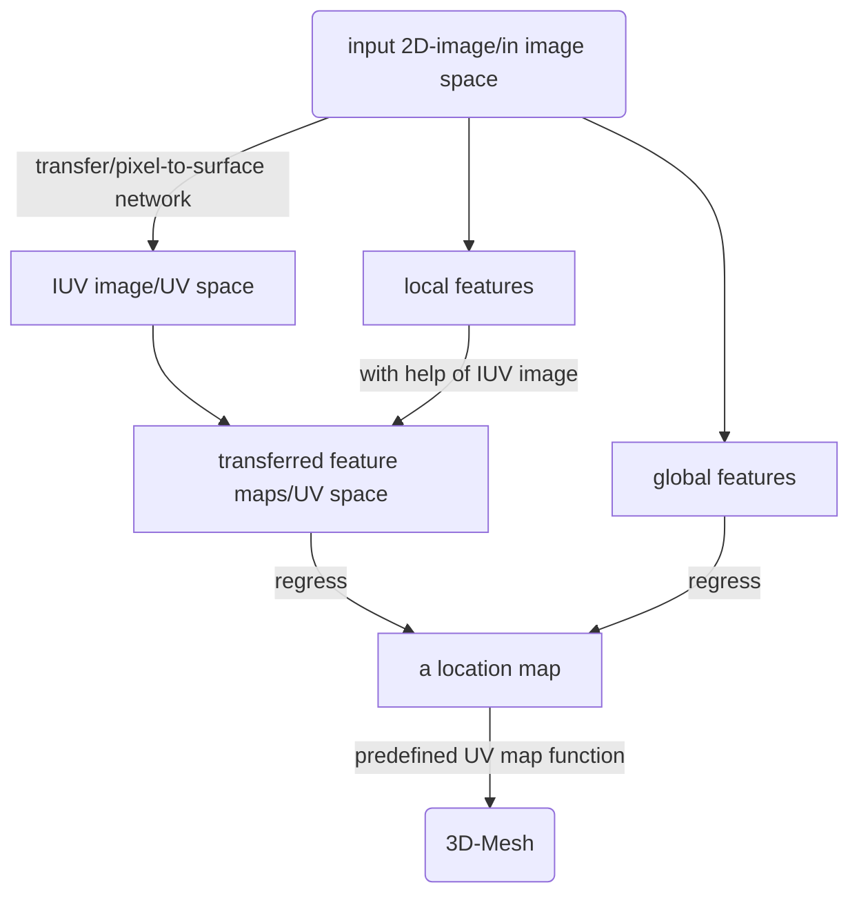

# Human Pose Estimation

## dataset

## 2D

### 坐标回归

1. 多阶段直接回归

   > deep pose : 首先使用CNN网络，以 coordinate为优化目标，直接回归joint 二维坐标，初始阶段能够得到一个大概坐标，接下来几个阶段以上一个阶段的输出结果(坐标点)以及周围切取的小尺寸图像为下一阶段的输入，不断修正坐标。
   >
2. 多阶段分步回归

   > IEF: 不同于deep pose 那种end to end一整个批次的训练，采用分为四个阶段，每个阶段进行三个完整epoch迭代，**但是不是每个阶段对总的误差进行梯度下降，而是选择总误差的一部分作为本阶段的迭代目标**。
   >

注：现阶段已经几乎不使用坐标不回归的方式，多尺度下鲁棒性不佳，精度不高。**思想：多阶段+多分辨率**

### 热图检测 (heatmap)

1. 显式添加结构先验

> heatmap net 在为各个关节生成heatmap后，可以基于**概率图模型并参照人体各关节的连通性**，显式的搭建**图结构或树结构**的先验网络连接关系

> 图结构模型: 将CNN和图结构模型进行联合训练。该方法的CNN在提取图像特征时采用了多分辨率机制，这样在构建heatmap时综合了关节点特征的局部细节和全局信息，保证了后续使用图结构处理 heatmap的像素分类准度和坐标定位精度

> 树结构模型: 对整个人体所有关节点进行建模，得到一颗人体关节点关系树。本文同样采用联合 训练的思路，将人体部件混合构建的树结构模型与深度 卷积神经网络（DCNN）一起进行端到端的训练

注：先验结构添加后，模型泛化能力弱

2. 隐式学习结构信息

   目前大部分都是基于**大感受野(Receptive Field)**机制隐式地学习结构信息

> **感受野**的定义是CNN每一层输出的 feature map上每个像素点在原始图像上映射的区域大小。感受野的值越大表示网络能学习到的原始图像特 征范围就越大，也意味着它可能蕴含更为全局，语义层次更高的特征；相反，值越小则表示其所包含的特征越 趋向局部和细节

> 增大感受野的方法大致有三种：扩大池化（pool）层、增大卷积核、累加卷积层
>
> 过大的pool操作会牺牲精度，如果通过反卷积还原精度则会添加大量的额外信息；增大卷积核相当于增加参数量，过于耗费计算资源；不断累加卷积层的代价是梯度消失

CMP and Hourglass

#### Convolutional Pose Machines，CPM

  这篇论文隐式利用了人体的结构信息，并且利用了**多阶段**的思路，将整个网络分成了多个stage。

1. 特征提取采用的网络为**VCG-19到conv4-2**。
2. 多stage阶段都是将上一阶段的输出以及原图处理得到的特征图融合作为下一阶段的输入
3. 中间监督：每个stage产生的heatmap都与ground truth计算得到loss。最后,我们将loss加和，作为 **Total Loss** 计算梯度，并进行反向传播。
4. 本文还提到了感受野的问题：**感受野越大，spatial context 越丰富，精度越高**，所以本文通过大kernel多stride+pooling的方法，增大感受野。
5. **缺点**：vcg-19 加上多stage的多个大核卷积，**计算量很大**

#### Hourglass [沙漏](https://blog.csdn.net/u013841196/article/details/81048237)

    相较于CPM的顺序卷积结构，沙漏网络结构适当缩小了卷积核尺寸，并对特征提取器 进行了改进，最终构建的模型也更加简洁高效。采用重复的**网络的上采样和下采样以及中间监督**（intermediate supervision）可以显著提升网络性能。总体的设计思路仍然是一方面利用**多分辨率**的 heatmap学习关节点的局部位置特征，一方面通过**多尺度感受野**机制学习获得关节点之间的结构特征

本文的设计基于模块到子网络再到完整网络的思想。一阶hourglass网络就是一个最简单的旁路相加，上半路在原尺度进行，下半路先经历下采样再进行上采样。(**降采样使用max pooling，升采样使用最近邻插值**). 对于二阶hourglass网络，就是在一阶的基础上将一阶网络嵌套进来。至于之后的高阶hourglass就是一层一层嵌套，从本质上说子模块都是一样的。

``

每次降采样之前，分出上半路保留原尺度信息；
每次升采样之后，和上一个尺度的数据相加；
两次降采样之间，使用三个Residual模块提取特征；
两次相加之间，使用一个Residual模块提取特征。

特点：

- 使用模块进行网络设计
- 先降采样，再升采样的全卷积结构
- 跳级结构辅助升采样
- 中继监督训练
  整个hourglass不改变特征的尺度，只改变特征的深度。

SHN在训练下一 个阶段时构建了类似于CPM的特征提取器，将三部分 的特征融合输入到下个阶段，即本阶段remap之后的 heatmap和本阶段最后输出的feature map，以及上一个 阶段通过残差机构传递过来的低分辨率特征，如上图

### 回归与检测混合模型（Heatmap + Coordinate）

#### 串联

#### 并联

双源卷积网络（DS-CNN）构建了两个并行的网络模块，即关节点检测网络（joint detection）和关节点定位回归网络（joint localizition）

joint detection用于检测图像补丁（Part Patch）包含的局部关节点类别信息；joint localiztion模 块通过结合整幅图像（Body Patch）和Part Patch的二进 制掩码回归关节点位置坐标。

## 多人姿态估计

方法主要分为 自顶向下(top-down)和自底向上(bottom-up)

> top - down : 先利用bounding box找到图像里的人，在对单个人分别进行单人姿态估计
>
> bottom - up ：直接找到图中所有的关节点，然后将关节点拼接在一起

### Top -down

这类方法能够很好的识别出感受野内的各个人，并且将各个人裁剪resize到差不多大的bounding boxes 内, 总之为 less sensitive to the scale variance of persons.
但是, 由于这种方法本质上是分两步进行的, 不能称为 完全的 end-to-end, 同时得出所有人的bounding boxes 这一额外计算要求使它 computationally intensive.

# 3D human pose estimation in video with temporal convolutions and semi-supervised training

## abstract

In Conference on Computer Vision and Pattern Recognition (CVPR), 2019.

ETH+Facebook AI Research+Google Brain

data: Human 3.6M HumanEva-I

code: [code](https://github.com/facebookresearch/VideoPose3D)

## Introdution

base on 2D keypoint detection followed by 3D pose estimation

> Attention: ambiguity(模糊性) which caused by that multiple/differernt 3d pose can map to the same 2D keypoints.

1. How to solve this problem?

   **before**: model temporal information with RNNs (recurrent neural networks)

   使用循环神经网络对时间信息建模(利用视频前后帧的信息)

   **This paper**: convolutional model(卷积模型) 可以并行处理多个帧, RNNs 做不到这一点

``

2d keypoints as the input and generate 3d pose estimates as output
from this pic ,we can see dilated temporal convolutions(扩张的时间卷积) capture long-term information

2. How to solve the data problem where labeled training data is scarce?

   **Semi-supervised training** !

   As we all know, the neural networks need large amounts of labeled training data and 3D pose estimation needs expensive motion capture setup and lengthy recording sessions to collect the labeld data. Semi-supervised training is useful.
3. How to relize point 2?

   we predict 2D keypoints for an unlabeled video with an off the shelf 2D keypoint detector, predict 3D poses, and then map these back to 2D space

> so this paper's contributions are point 1 and point 2:
>
> 1. a simple and efficient approach for 3D human pose estimation in video on dilated temporal convolutions on 2D keypoints trajectories ( with fewer parameters to keep the same level of accuracy)
> 2. a simple semi-supervised approach which exploits unlabeled video, and is effective when labeled data is scarce. (This method needs camera intrinsic parameters rather than ground-truth 2D annotations or multi-view ...)

## Related work

1. Two-step pose estimation:  2D $\rightarrow$  3D

   > A new family of 3D pose estimators builds on top of 2D pose estimators by first predicting 2D joint positions in image space (*keypoints*) which are subsequently lifted to 3D (diffculty: accurate 2D poses).
   >
2. Video pose estimation:  1 fps $\rightarrow$ temporal information

   > Most previous work operates in a single-frame setting but recently there have been efforts in exploiting temporal information from video to produce more robust predictions and to be less sensitive to noise
   >
3. Semi-supervised training: face the scarce data situation

   > before: Many unlabeled data have been used in (Joint 2D and 3D pose estimation or transfer 2D features to estimate 3D tasks), however, in fact, these recordings are not readily available.
   >
   > GAN (generative adversarial networks) works when only 2D annotations are available.
   >
4. Paper's work

   > this paper uses **detected keypoint coordinates** instead of heatmaps which ensures that it can use 1-D convolution over the time dimension( instead of 2-D for heatmaps or 3-D for heatmap sequences)
   >
   > we show that **Mask R-CNN and cascaded pyramid network (CPN)** detections are more robust for 3D human pose estimation comparing to the popular *stacked hourglass networks*
   >

## **Temporal dilated convolutional model**

https://blog.csdn.net/fengye2two/article/details/103831133

Our model is **a fully convolutional architecture** with *residual connections* that takes a sequence of **2D poses as input** and transforms them through *temporal convolutions*.

> 卷积模型可以同时处理2D姿态信息和时间维度信息（RNN无法做到)

The input layer takes the concatenated (x, y) coordinates of the *J* joints for each frame and applies a temporal convolution with kernel size *W* and *C* output channels. This is followed by *B* ResNet-style blocks which are surrounded by a skip-connection.Each block fifirst performs a 1D convolution with kernel size *W*  and dilation factor D=W``B``,followed by a convolution with kernel size 1

此结构把每帧关节点的x, y轴坐标作为输入，应用过滤器为*W*的卷积层来输出*C*个特征， 然后应用*B*个ResNet-风格的残差块,个残差块执行过滤器大小为W*的空洞因子为*D=W``B``的1D卷积操作

## Semi-supervised approach

我们利用现有的2D姿态检测器和未标注的视频，将反向映射损失加入到监督损失函数中。去解决未标签数据的自动编码问题的关键思想是：将3D姿态预测作为编码器，把预测的姿态反向映射到2D姿态，基于此进行一个重建损失的计算。

> 带有3D姿态预测模型的半监督训练采用预测的2D关节点作为输入，我们回归人体的3D轨迹并添加一个软限制（soft-constraint) 将未标签预测的平均骨骼长度映射到标签的数据中。所有的都在一起联合训练。W M P J P E  代表带有权重的 M P J P E
>
> 此方法的概括在图三中可见，我们有一个监督元件和一个，非监督元件（充当正则器）。这两个对象是联合优化的。有标签的数据占据一个批次的前半部分、无标签的数据占据一个批次的后半部分。对于有标签的数据我们采用实际的3D姿态作为目标，训练一个有监督的损失。这个未标签的数据被用于去执行一个自动编码器损失，即将预测的3D姿态反向映射到2D，然后检查它输入的连贯性

# HigherHRNet-Human-Pose-Estimation

## abstract

In Conference on Computer Vision and Pattern Recognition (CVPR), 2020
UIUC + Microsoft+ University of Oregon
data: COCO 2017 CrowdPose
code: [code](https://github.com/HRNet/HigherHRNet-Human-Pose-Estimation)

## Introduction

一些基本概念 bottom-up and top-down
本文解决的问题之一就是 尺度变化(scale variation)即多人姿态估计中 同一感受野下有的人size 大 有的小。 之前的论文中都是通过 top -down 的方法，这种方法是可以crop and resize bounding boxes 保证了 less sensitive to scale variance.

step1. 之前的提出的bottom-up 类方法都不太关注scale variation, 不少论文中都是选择了低分辨率的input 去预测heatmap.
step2. PersonLab  generates high-resolution heatmaps by increasing the input resolution. 但是这样的办法在input resolution too large 时，会导致 large peson 的预测精度降低。
step3. 本文:  Scale-Aware High-Resolution Network (HigherHRNet)

> 1. 高分辨率特征金字塔模块产生高分辨率的heatmap (based on HRNet)
> 2. 对于 scale variation 问题，提出了一种 多分辨率策略使不同分辨率的目标进入不同的特征金字塔
> 3. 多分辨率 heatmap融合策略去生成 scale-aware 的高分辨率heatmap.

## 贡献

试图解决在自下而上的多人姿态估计中很少研究的尺度变化问题
HigherHRNet，**它在训练阶段通过多分辨率监督生成高分辨率特征金字塔**（在训练阶段生成具有多分辨率监督的高分辨率特征金字塔），**在推理阶段中引入了一种简单的多分辨率热图聚合策略来生成尺度感知（scale-aware）的高分辨率热图（有利于小尺寸的人）**

## Related works

**Feature pyramid network**([FPN](https://arxiv.org/abs/1612.03144)): https://zhuanlan.zhihu.com/p/61536443
**High resolution feature maps** : 4 methods to generate

1. **Encoder-decoder**获编码器路径中的上下文信息并恢复解码器路径中的高分辨率特征
2. **Dilated convolution**用于去除多个步长卷积/max池以保持特征图的分辨率。扩展卷积避免了空间信息的丢失，但增加了计算量
3. **Deconvolution(transposed convolution)** 在网络末端按顺序使用，以有效地提高feature map的分辨率
4. **高分辨率网络（HRNet）**被提出作为一种有效的方法，以保持高分辨率通过整个网络。
5. HRNet由多个分辨率不同的分支组成。**低分辨率分支捕获上下文信息，高分辨率分支保留空间信息。**HRNet通过分支之间的多尺度融合，可以生成语义丰富的高分辨率特征图

## Higher-Resolution Network

### [HR Net](https://zhuanlan.zhihu.com/p/143385915)

- HRNet最初是为自上而下的姿态估计而设计的。在这项工作中，我们采用HRNet bottom-up的方法，通过添加一个1×1卷积来预测热图和标记图。
- 我们只使用最高分辨率（输入图像的1/4）的特征图进行预测。我们为每个关键点使用标量标记。

### **Heatmap Aggregation for Inference**

- 在推理过程中，提出了一种热图聚合策略。
- - 使用双线性插值将所有不同分辨率的预测热力图上采样到输入图像的分辨率，并将所有尺度的热力图进行平均，以进行最终预测。
- 我们使用热图聚合是为了实现尺度感知的姿态估计。
- 我们在HigherRnet找到不同尺度的热图，更好地捕捉不同尺度的关键点。
- - 例如，在低分辨率热图中漏掉的小尺寸的人的关键点可以在高分辨率热图中恢复。因此，从不同分辨率中平均预测的热力图使HigheHRNet成为一个尺度感知的姿态估计器

## DenseBody: Directly Regressing Dense 3D Human Pose and Shape From a Single Color Image

云从科技+上交  2019

https://arxiv.org/abs/1903.10153

### Introduction

•本文提出的方法则用 **UV** **位置映射图**来表示 3D 人体几何结构，其有如下优点：

•首先，它能保存点和点之间的空间邻接信息，相比一维的向量表示，该信息对精确重建更为关键；

•其次，相比体素这样的 3D 表示，它的维数更低，因为体素表示法中，大量不在表面上的点其实用处不大；

•最后，这是一个 2D 表示，所以我们能直接使用现成的 CNN 网络

## 3D Human Mesh Regression with Dense Correspondence

2020 IEEE/CVF Conference on Computer Vision and Pattern Recognition (CVPR)
doi: 10.1109/CVPR42600.2020.00708
https://ieeexplore.ieee.org/document/9157190/

### Introdution

**DecoMR** is the model proposed in this paper.

首先 3D shape 表示方法有三类：1. mesh 网状2. voxel体素 3. point clouds点云

这里选择Mesh,原因是由于和计算机图形引擎的适配好，存储需求空间合理。

但是Mesh有一个巨大缺陷, 即dense correpondence (between mesh surface and imgae pixels) missing.

三类解决思路:

1. global image feature
2. hierarchical projection and refinement
3. This paper proposes a new method (a new continuous UV map)

> Every point on the mesh surface is represented by its coordinates on the continuous UV map.

前两类思路是直接忽略了这个问题所在的(1),或者需要花费大量时间(2).

整体流程大致如下

两个贡献：

1. 上图左侧的 transferred local features 解决了 2d image 输入 和 3D-mesh 之间的 missing dense correpondense.
2. 上图最后一步中所需要的 UV map.

### Related Work

**Optimization-based methods**

> Work in optimizing the parameters of an predefined 3D human mesh models (SMPL, SCAPE).
>
> 有的使用ground-truth body landmark locations  [[8]](https://www.computer.org/csdl/proceedings-article/iccv/2009/05459300/12OmNwlZu78) 2009年的论文很老
>
> 有的应用2D关键点检测网络[[4]](https://arxiv.org/abs/1607.08128) (keep it SMPL:...)
>
> 有的增加了额外的landmark[22]
>
> 最新的[[38]](http://www.maths.lth.se/sminchisescu/media/papers/Zanfir_Monocular_3D_Pose_CVPR_2018_paper.pdf)可以实现多人人体重建 incorporating human semantic part segmentation clues, scene and temporal constrains.

**Learing-based methods**

1. model-based methods

> Work in parameterized 3D human model and model parameter regression.
>
> 例如：[[18]](http://arxiv.org/abs/1712.06584) 直接从 RGB 输入图片回归学习 SMPL 参数
>
> 不少方法采取策略(intermediate representation)提高鲁棒性：
>
> 借助2D joint heatmaps [[26]](http://arxiv.org/abs/1805.04092)
>
> 借助semantic segmentation map [[25]](http://arxiv.org/abs/1808.05942)
>
> 借助IUV images [[36]](https://arxiv.org/abs/1910.00116)
>
> 最近的 [SPIN [20]](https://arxiv.org/abs/1909.12828) 通过监督网络将参数优化融合为网络训练。

比起model-free， model-based methods 更能构建出符合人体结构的shape(因为有先验知识)，但是也正因为predefined human models 的原因，model-based methods的表示能力被限制了。

**这篇 paper 中不会去regress模型的参数，而是直接输出 mesh的3d坐标**

2. model-free methods

> Some methods do not rely on human models and regress 3D human body representation directly from image
>
> CMR (Covolutional Mesh Regression)  Graph-CNN regress 3D coordinates of vertices from image features.
>
> [Bodynet](http://arxiv.org/abs/1804.04875) estimates volumetric representation of 3D human with a Voxel-CNN
>
> **IUV** Densebody estimates vertex location in the form of UV-position map

### Method

pipeline里主要由两个部分组成 correspondence net 和 localization network

**Correspondence Network** (image space)

> 1. encoder-decoder architecture (encoder: Resnet-50)
> 2. to estimate an IUV image
> 3. loss: $L_{IUV}=\lambda_cL_C+\lambda_rL_r$
>
> $L_c$: binary cross-entropy loss for classifyinh each pixel as "fore" or "back"
>
> $L_r$: $l_1$ regression loss for predicting the exact UV coordinates

**Location net** (UV space)

> 1. Input: transferred local features + global feature vector
> 2. 得到一个location map(可以从而得到mesh), whose pixel value is the 3D coordinates of the corresponding points on the mesh surface
> 3. The LNet is a light CNN with skip connections taking the transferred local image features, expanded global image feature and a reference location map as input.

location $\rightarrow$ Mesh 采用的是一个预先定义好的UV mapping function

### The cotinuous UV map

SMPL中UV map 没有保留原本image的连续性, 故这篇论文提出了一个新的UV map 能够更好地保存连续性。

## **VIBE: Video Inference for Human Body Pose and Shape Estimation**

利用时域信息以及GAN网络提升精度

问题1: 精度不够是因为受制于数据集的不充分

思路1：End-to-end recovery of human shape andpose. In *IEEE Conference on Computer Vision and Pattern*Recognition, 2018.

> GAN! 2D keypoint from the video(GT), 3D human motions (AMASS)

**VIBE takes in-the-wild images as inputand predicts SMPL body model parameters using a convolutional neural network (CNN)** （生成网络）

> CNN 这里可以尝试改进 (具体见 Learning to Reconstruct 3D Human Pose and Shapevia Model-fifitting in the Loop 以及 **End-to-end Recovery of Human Shape and Pose**)

**a motion discriminator takes predicted poses along with the poses sampled from the AMASS dataset and outputs a real/fake label for each sequence**（判别网络）

### contributions

1. GAN: make use of AMASS dataset for **adversarial** training
2. GAN:attention mechanism (determine the weights of different frames) in **discriminator**
3. comparion among different temporal architectures
4. state-of-the-art result

### 网络结构分析

**Generator():**
	backbone ResNet-50
	temporal encoder: 2-layer GRU
	SMPL regressor: 2 Fully-connected layer (1024 neurons) output:85
**Discriminator**:
	classifier：T/F （0/1）
	**self-attention** MLP\*2 (1024) tanh 激活函数

帧数：16？（或许可以增加，但论文中提到实验包括了8，16，32，64，128）其中16效果最好

尝试self-attenion 改为 transformer，T改为27/81(根据videopose的经验)
